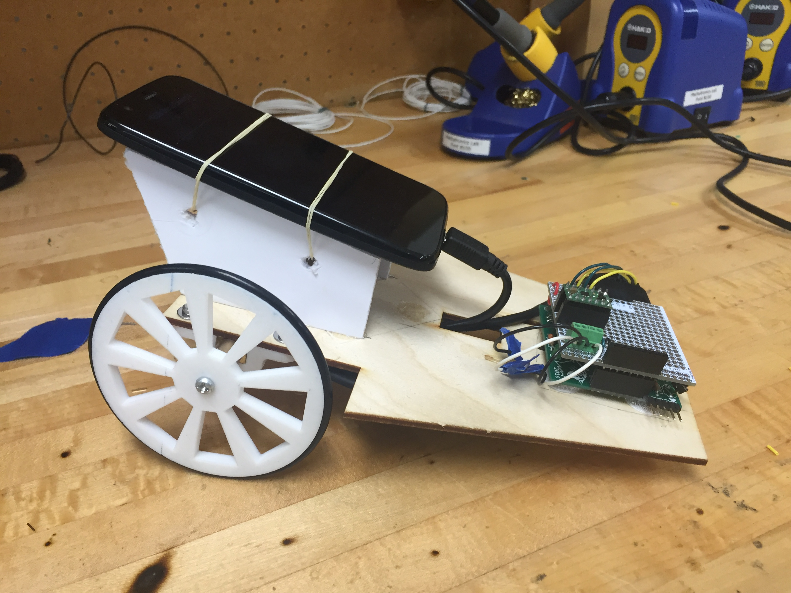

# ME433
Homework and other files for ME 433 - Advanced Mechatronics, which I completed in the Spring quarter of 2016 at Northwestern University. 

## Final Project
Here's a sneak peek at my final project - a line following robot. The camera on an Android phone detects the line, then communicates with a PIC32 microcontroller over USB. The PIC32 implements a PI alogorithm to control the two motors in order to follow the line around a track. I designed the chassis, motor mounts, and wheels in Onshape and fabricated them using a laser cutter and 3D printer, respectively.

